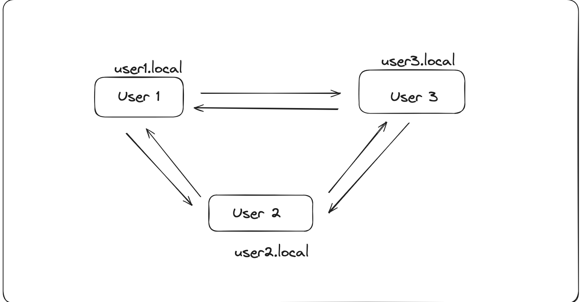

# `p2p` - Peer to Peer Data Transfer

Peer to Peer Data Tranfer Protocol

## Install

For now, you need to compile it yourself:

```shell
git clone https://github.com/ansuman12chat/p2p.git
```

```shell
go install cmd/p2p/main.go
```

Make sure the `$GOPATH/bin` is in your `PATH` variable to access the installed `p2p` executable.

## Usage

The receiving peer runs:

```shell
$ p2p receive
Your identity:

	16Uiu2HAm9YBEqaJE1fHt1XXrawCJoMAeYm5sN6nzUGWGMQB4kfb

Waiting for peers to connect... (cancel with strg+c)
```

The sending peer runs:

```shell
$ p2p send my_file
Querying peers that are waiting to receive files...

Found the following peer(s):
[0] 16Uiu2HAkwyP8guhAXN66rkn8BEw3SjBavUuEu4VizTHhRcu7WLxq

Select the peer you want to send the file to [#,r,q,?]:
```

At this point the sender needs to select the receiving peer, who in turn needs to confirm the file transfer.


## High Level Design
